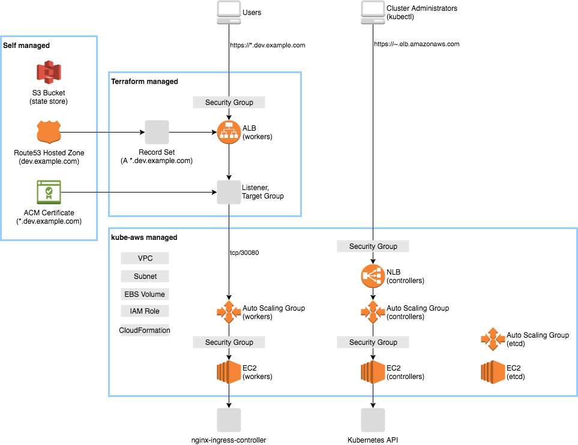

# Kubernetes starter with kube-aws and Terraform

This is a Kubernetes starter with kube-aws and Terraform to build the following stack.




## Goals

- You can operate the cluster by `kube-aws`
- You can access to the Kunernetes API by `kubectl`
- You can access to services via a HTTPS wildcard domain


## Getting Started

### Prerequisite

You must have followings:

- an AWS account
- an IAM user and credentials
- a Route53 hosted zone for the wildcard domain, e.g. `dev.example.com`
- an ACM certificate for the wildcard domain, e.g. `*.dev.example.com`

Install following tools:

```sh
brew install kube-aws
brew install kubernetes-helm
brew install awscli
brew install terraform
```

### Create a state store

Set the cluster information.

```sh
# .env
export TF_VAR_k8s_cluster_name=hello
export TF_VAR_alb_external_domain_name=dev.example.com
export AWS_DEFAULT_REGION=us-west-2
export S3_BUCKET_NAME=hello-k8s
```

Create a bucket for kube-aws and the Terraform state store.

```sh
aws s3api create-bucket \
  --bucket $S3_BUCKET_NAME \
  --region $AWS_DEFAULT_REGION \
  --create-bucket-configuration LocationConstraint=$AWS_DEFAULT_REGION
```

### Create a cluster

Create a cluster. See [kube-aws Getting Started](https://kubernetes-incubator.github.io/kube-aws/getting-started/) for details.

```sh
kube-aws init --cluster-name=hello \
  --external-dns-name=$TF_VAR_alb_external_domain_name \
  --hosted-zone-id=**** \
  --region=us-west-2 \
  --availability-zone=us-west-2a \
  --key-name=rabbit.local \
  --kms-key-arn=arn:aws:kms:us-west-2:****:key/****

vim cluster.yaml  # see below

kube-aws render credentials --generate-ca
kube-aws render stack
kube-aws validate --s3-uri $S3_BUCKET_NAME
kube-aws up --s3-uri $S3_BUCKET_NAME
```

You should add remaining subnets because an ALB or a RDS subnet group needs them.

```yaml
# cluster.yaml (snip)
subnets:
  - name: k8s-subnet-a
    availabilityZone: us-west-2a
    instanceCIDR: "10.0.0.0/24"
  - name: k8s-subnet-b
    availabilityZone: us-west-2b
    instanceCIDR: "10.0.16.0/24"
  - name: k8s-subnet-c
    availabilityZone: us-west-2c
    instanceCIDR: "10.0.32.0/24"

controller:
  subnets:
    - name: k8s-subnet-a
etcd:
  subnets:
    - name: k8s-subnet-a
worker:
  nodePools:
    - name: nodepool1
      subnets:
        - name: k8s-subnet-a
```

Verify the cluster.

```sh
export KUBECONFIG=$PWD/kubeconfig
kubectl get nodes
```

### Create a load balancer

Initialize Terraform.

```sh
cd ./terraform
terraform init \
  -backend-config="bucket=$S3_BUCKET_NAME" \
  -backend-config="key=terraform.tfstate"
```

Create a load balancer and update the Route53 zone.

```sh
terraform plan
terraform apply
```

### Open the Kubernetes dashboard

```sh
kubectl proxy &
```

Open http://localhost:8001/api/v1/namespaces/kube-system/services/https:kubernetes-dashboard:/proxy/.


### Install system services

Install the ingress controller.

```sh
helm repo update
helm install stable/nginx-ingress --namespace kube-system --name nginx-ingress -f helm/nginx-ingress-config.yaml
```

Open https://dummy.dev.example.com and it should show `default backend - 404`.

### Deploy echoserver

Create a deployment, service and ingress.

```sh
kubectl apply -f echoserver.yaml
```

Open https://echoserver.dev.example.com.

### Cleanup

```sh
terraform destroy
kube-aws destroy
```


## Tips

### Working with managed services

You can attach the security group `allow-from-nodes.hello` to managed services such as RDS.

### Restrict access

You can restrict access to services (the external ALB) by Terraform.
Also you should enable the internal ALB to make nodes can access to services via the same domain.

```hcl
variable "alb_external_allow_ip" {
  default = [
    "xxx.xxx.xxx.xxx/32",
  ]
}

variable "alb_internal_enabled" {
  default = false
}
```

Note that you should create a dedicated Route53 hosted zone for the Kubernetes API, or Kubernetes workers cannot descover masters.

### Reduce cost for testing purpose

The cheaper instance type may work.

```yaml
controller:
  count: 1
  instanceType: t2.micro
  rootVolume:
    size: 20
    type: standard
  subnets:
    - name: k8s-subnet-a

etcd:
  instanceType: t2.nano
  rootVolume:
    size: 20
    type: standard
  dataVolume:
    size: 20
    type: gp2
  subnets:
    - name: k8s-subnet-a

worker:
  nodePools:
    - name: nodepool1
      count: 1
      instanceType: m3.medium
      rootVolume:
        size: 20
        type: standard
      spotPrice: "0.02"
      subnets:
        - name: k8s-subnet-a
```
